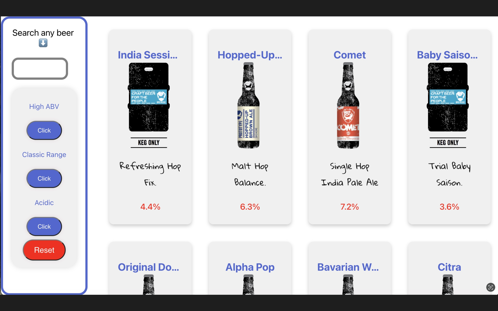

--PUNK API--

This project is a web application that allows users to explore a variety of beers obtained from the Punk API. Users can filter the beer collection based on different criteria and search for specific beers using keywords.

--Features--

Beer Filtering: Users can apply filters to the beer collection based on various attributes. The available filters include ABV (Alcohol By Volume) greater than 6%, brewed before 2010, and pH value less than 4.
Search Functionality: Users can search for specific beers by entering keywords in the search bar. The application dynamically updates the beer list based on the search input.
Beer Details: Users can click on individual beers to view detailed information about them, including their name, description, and other relevant details.
Responsive Design: The application is designed to be responsive, ensuring a seamless user experience across different devices and screen sizes.

Runs the app in the development mode.\
Open [http://localhost:3000](http://localhost:3000) to view it in your browser.

React: The frontend of the application is built using React, a popular JavaScript library for building user interfaces. React enables efficient rendering of components, dynamic updates, and smooth interactivity.
React Router: React Router is utilized to handle routing within the application, enabling navigation between different pages and components.
Punk API: The Punk API serves as the source of beer data for the application. It provides a comprehensive collection of beers with associated attributes such as ABV, description, and more.
CSS (SCSS): The application is styled using SCSS, a CSS preprocessor, to enhance maintainability and modularity of the stylesheets.
